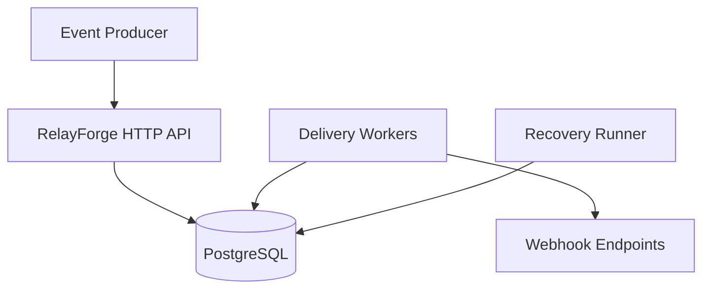

# RelayForge

RelayForge is a reliable webhook delivery service built with Go and PostgreSQL. It accepts events, creates one delivery for each active endpoint, and processes deliveries asynchronously with retry and recovery mechanisms.

The project focuses on backend reliability concepts including transactional persistence, concurrent job claiming, idempotency, retry scheduling, failure recovery, and graceful shutdown.

## Features

* Idempotent event submission
* Transactional event and delivery creation
* Multi-endpoint webhook fan-out
* Concurrent background delivery workers
* Atomic job claiming with PostgreSQL
* Exponential backoff with jitter
* `Retry-After` handling
* Bounded delivery attempts
* Dead-letter states for exhausted deliveries
* Stale-claim recovery
* Graceful HTTP-server and worker shutdown
* Structured logging
* Unit, integration, concurrency, and end-to-end tests

## Architecture



### Event lifecycle

1. A client submits an event with an idempotency key.
2. RelayForge creates the event and its endpoint deliveries in one database transaction.
3. Background workers atomically claim due deliveries.
4. A worker sends the payload to the destination endpoint.
5. RelayForge records the attempt and updates the delivery state.
6. Retryable failures are scheduled using exponential backoff with jitter.
7. Deliveries that exhaust their allowed attempts enter a terminal dead state.
8. The recovery runner returns abandoned claims to the retry queue.

## Delivery Guarantee

RelayForge provides **at-least-once delivery**.

A destination can receive the same webhook more than once if it successfully processes a request but RelayForge stops before recording the successful result. Receivers should therefore process webhooks idempotently and deduplicate requests using the stable delivery identifier.

RelayForge does not guarantee exactly-once delivery.

## Delivery States

A delivery moves through states such as:

```text
pending
  → processing
  → succeeded

processing
  → retry_scheduled
  → processing

processing
  → dead
```

If a worker stops after claiming a delivery, stale-claim recovery makes the delivery eligible for processing again after its claim lease expires.

## Reliability Design

### Transactional fan-out

The event and all corresponding delivery records are inserted in one PostgreSQL transaction. A partial fan-out is never committed.

### Atomic claiming

Workers claim due deliveries through a database operation that prevents competing workers from successfully claiming the same available row simultaneously.

### Retry scheduling

Temporary failures are retried using exponential backoff with jitter. When supported by the destination response, `Retry-After` influences the next eligible attempt time.

### Stale-claim recovery

A process can stop after committing a claim but before finishing the delivery. RelayForge periodically identifies expired claims and returns them to the retry queue.

### Graceful shutdown

During normal shutdown, RelayForge stops accepting new HTTP requests, allows active handlers to finish, cancels background processing, and waits for workers and recovery tasks to exit.

## Running Locally

### Requirements

* Go
* PostgreSQL

### Configuration
Set the database url in `cmd/relayforge/main.go`

The database must exist and have the repository migrations applied before starting the service.

Verify the database connection:

```bash
go run ./cmd/relayforge ping
```

Start RelayForge:

```bash
go run ./cmd/relayforge serve
```

The server listens on:

```text
http://localhost:8080
```

## Testing
set the test database url in `internal/delivery/delivery_integration_test.go` and `internal/store/postgres/store_integration_test.go`

Run the complete test suite:

```bash
go test -p=1 ./... -count=1
```

Run it with Go's race detector:

```bash
go test -race -p=1 ./... -count=1
```

The tests cover behavior including:

* Transaction rollback
* Duplicate event submissions
* Concurrent worker claiming
* Retry scheduling
* Temporary and permanent delivery failures
* Request cancellation
* Stale-claim recovery
* Graceful worker termination
* End-to-end webhook delivery

Integration-test packages are currently serialized with `-p=1` because they share one resettable PostgreSQL test database.

## Project Structure

```text
cmd/relayforge/          Command-line entry point
internal/delivery/       Sending, processing, and retry policy
internal/httpapi/        HTTP handlers and API behavior
internal/store/postgres/ PostgreSQL persistence
internal/worker/         Delivery workers and stale-claim recovery
migrations/              Database migrations
```

## Known Limitations

* Complete docs and .env usage are not implemented yet.
* Webhook request signing is not implemented yet.
* Containerized local deployment is not available yet.
* Automated CI checks are not configured yet.
* Production metrics and distributed tracing are not implemented yet.
* Integration-test packages share one test database.
* At-least-once delivery permits duplicate requests after ambiguous failures.
* RelayForge has not yet been validated for production workloads.

## Roadmap

* Add HMAC webhook signing
* Add Docker and Docker Compose
* Add CI/CD

## Status

RelayForge is an actively developed educational project. Its current purpose is to demonstrate and deepen my understanding of reliable backend-system design; it should not yet be treated as a production-hosted webhook service.

